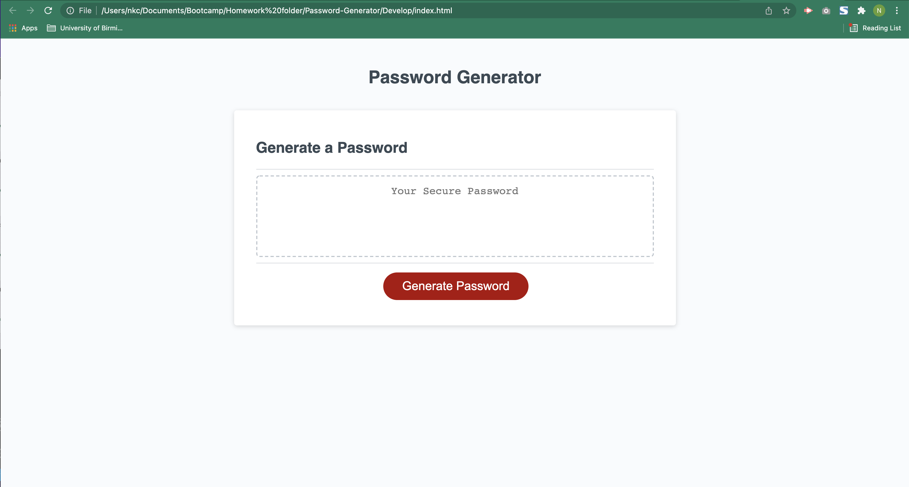
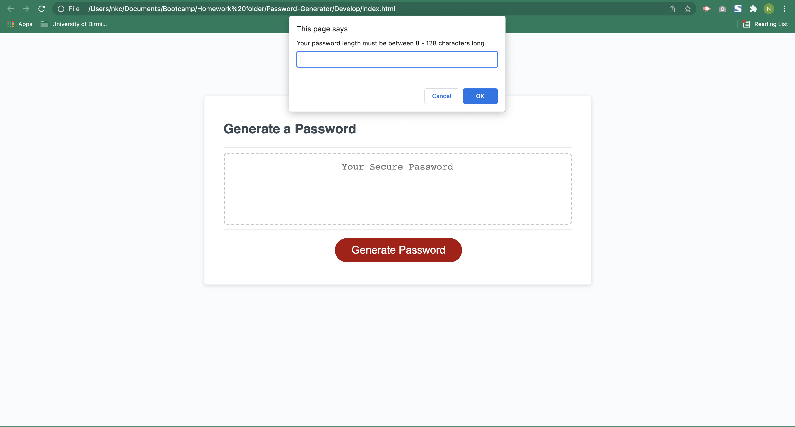
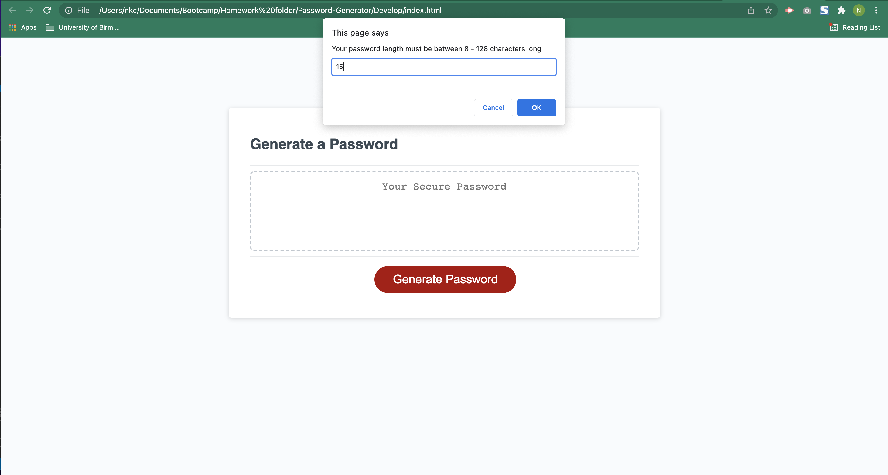
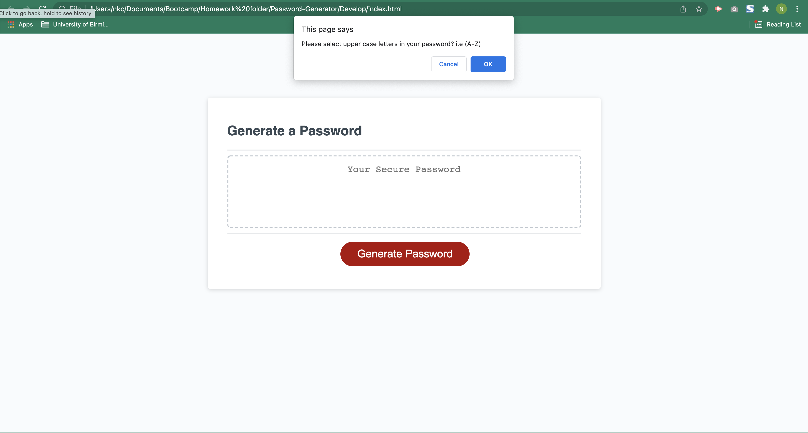
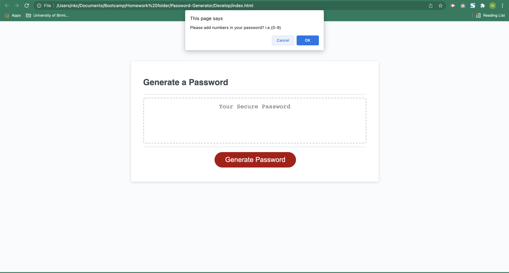
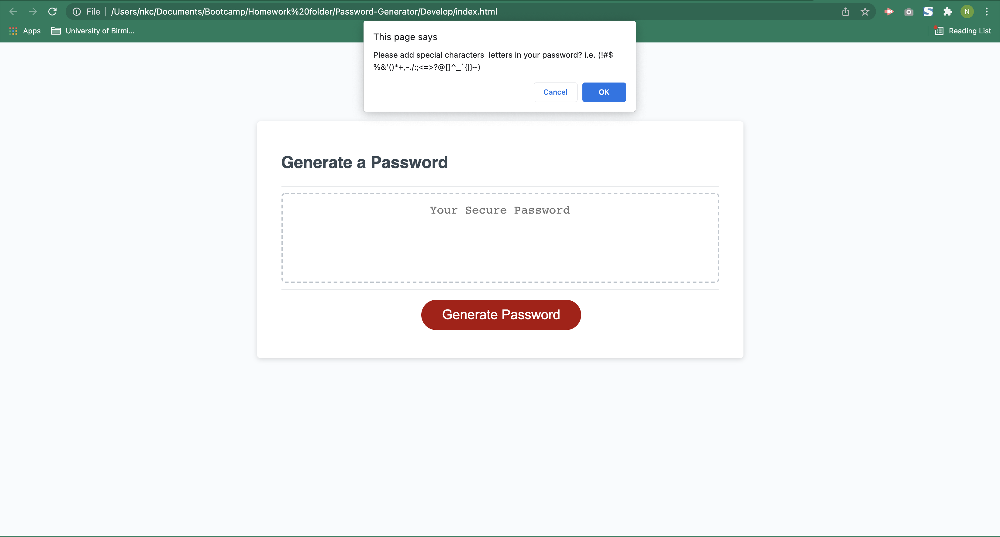
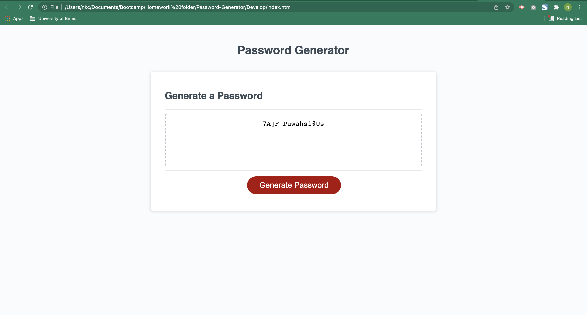

# Password-Generator

We were tasked to help build a password generator that meets the following requirements.

1. Prompt the user once the button has been clicked.
2. To pick a length between 8 - 128 characters long.
3. To conifirm to include upper,lower,numbers and special characters.
4. The confirmations are validated & 1 character type is selected.
5. Generate the password with all characters selected.
6. Displayed on the webpage for the user to see.

Below are screen shots of the finished Password Generator.

Start Page
	

1st Prompt

2nd Prompt

3rd Prompt

4th Prompt

5th Prompt

6th Prompt

7th Prompt

